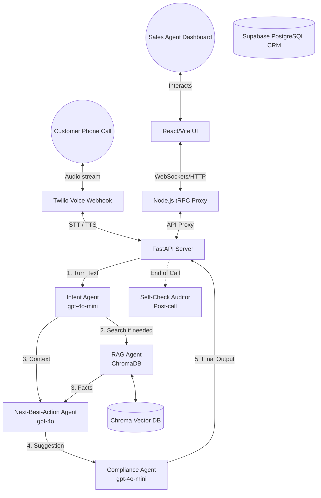

# FlexiPay AI Voice Co-Pilot for Inside Sales

An enterprise-grade AI Voice Co-Pilot designed to assist sales and marketing teams in onboarding customers to the Pay-in-3, zero-cost EMI affordability product. This system listens to customer calls in real-time, classifies intent, retrieves accurate facts via RAG, and pushes live compliance-checked "Next Best Actions" (NBA) to sales agents.

## What We Have Built Up to Now

1. **Multi-Agent AI Brain (LangGraph)**
   - Designed a scalable, stateful AI graph utilizing specialized agents instead of one fragile mega-prompt.
   - **Intent Agent**: Uses fast `gpt-4o-mini` to classify customer intent (e.g., objection, KYC question, product inquiry) and sentiment.
   - **RAG Agent**: Queries a local Chroma DB vector database to fetch factual truths, ensuring the AI never hallucinates terms.
   - **NBA Agent**: Uses high-stakes reasoning via `gpt-4o` to calculate the optimal coaching suggestion for the sales agent to say next.
   - **Compliance Agent**: Uses `gpt-4o-mini` and strict rule-sets to block the AI from guaranteeing loans or modifying interest rates, flagging them for human review.
   - **Self-Check Agent**: Runs at the end of the call to audit the entire transcript against business guardrails and logs the cost.

2. **Telephony Integration**
   - **Twilio Voice Webhook**: Added a FastAPI webhook (`/twilio/voice`) capable of receiving live incoming customer calls, gathering speech-to-text, streaming it through LangGraph, and replying using Text-to-Speech.

3. **React Agent Dashboard**
   - Wired an existing Vite/React frontend through a tRPC Node.js server directly to the Python LangGraph backend.
   - The UI serves as a live dashboard for the human sales agent to read the Co-Pilot's suggestions and intent warnings in real time.

## Architecture Diagram (UML)

## Next Steps

1. **Supabase CRM Migration**: 
   Migrate the local in-memory/SQLite mock database to our live cloud Supabase PostgreSQL instance. This involves updating the Drizzle ORM schemas and running a schema push.
2. **Audio Streaming Optimization**:
   Upgrade the standard Twilio `<Gather>` method to Twilio Media Streams (WebSockets) for ultra-low latency, sub-second conversational AI responses.
3. **Automated Follow-ups**:
   Build a post-call webhook that automatically sends SMS/Email signup links to the customer if the "ready_to_convert" intent was achieved.
4. **Deploy to Cloud**:
   Push the containerized Python backend to AWS/Render and the React UI to Vercel.
